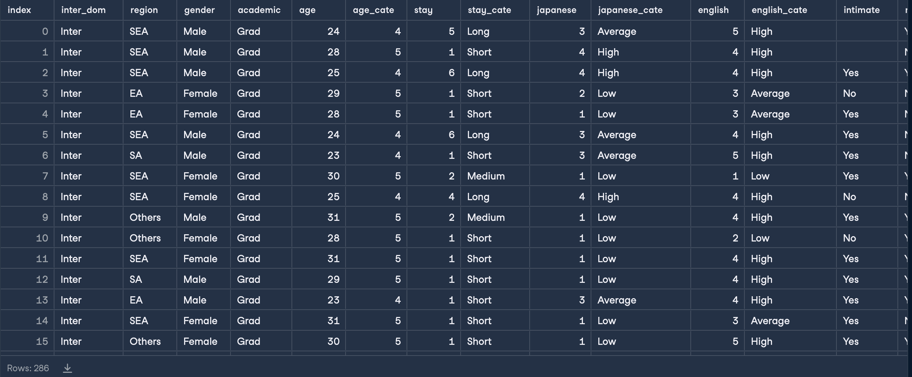
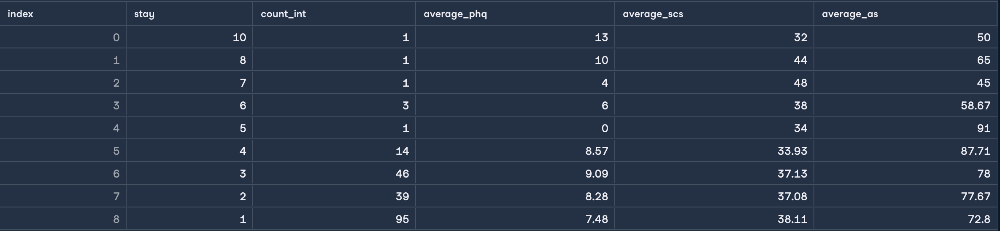

<h1>Analyzing-Students-Mental-Health</h1>
<h3>Datacamp</h3>

Does going to university in a different country affect your mental health? A Japanese international university surveyed its students in 2018 and published a study the following year that was approved by several ethical and regulatory boards.

The study found that international students have a higher risk of mental health difficulties than the general population, and that social connectedness (belonging to a social group) and acculturative stress (stress associated with joining a new culture) are predictive of depression.

 

Here is a data description of the columns you may find helpful.

 &emsp; &ensp;Field Name	&emsp; &emsp; &emsp; &emsp; Description

<ul>
  <li><b>inter_dom</b> => Types of students (international or domestic)</li>
  <li><b>japanese_cate</b> => Japanese language proficiency</li>
  <li><b>english_cate</b> => English language proficiency</li>
  <li><b>academic</b> => Current academic level (undergraduate or graduate)</li>
  <li><b>age</b> => Current age of student</li>
  <li><b>stay</b> => Current length of stay in years</li>
  <li><b>todep</b> => Total score of depression (PHQ-9 test)</li>
  <li><b>tosc</b> => Total score of social connectedness (SCS test)</li>
  <li><b>toas</b> => Total score of acculturative stress (ASISS test)</li>
</ul>
 
 

Some data in <b>students table</b>, which have 286 rows:

 
 

We'll see if the length of stay for international students is a contributing factor to mental health difficulties

 
 

The result of the length of stay, and how many of them are international students: 

<h3>Note:</h3>The code is in code Folder, and table is csv file

